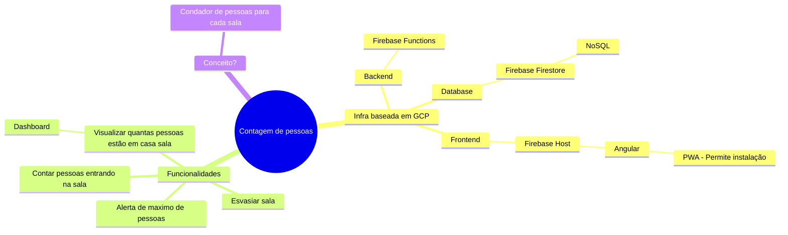

```mermaid
mindmap
  root((Contagem de pessoas))
    Infra baseada em GCP
        Backend
            Firebase Functions
        Database
            Firebase Firestore
                NoSQL
        Frontend
            Firebase Host
                Angular
                    PWA - Permite instalação
    Funcionalidades
        Contar pessoas entrando na sala
        Esvasiar sala
        Alerta de maximo de pessoas
        Visualizar quantas pessoas estão em casa sala
            Dashboard
    Conceito?
        Condador de pessoas para cada sala
```