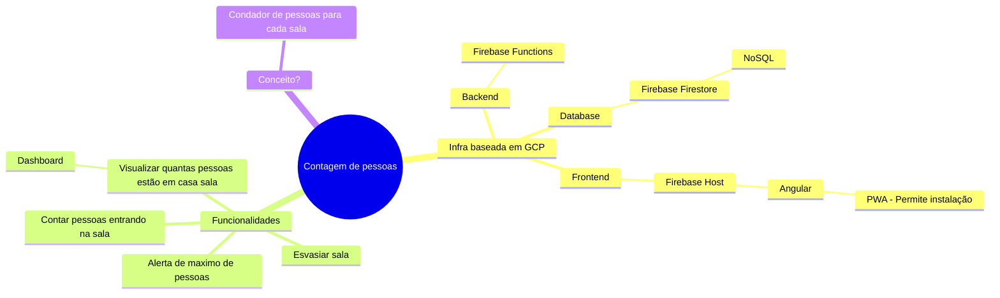
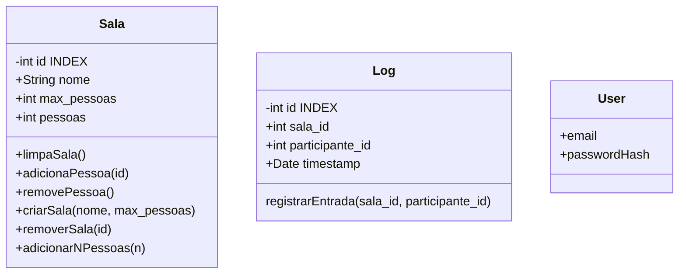
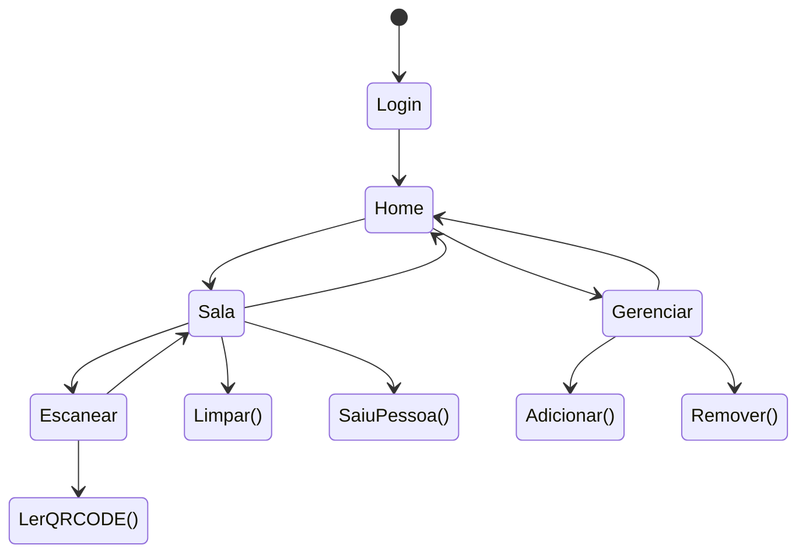

# Arquitetura do sistema

## Visão geral

```mermaid
mindmap
  root((Contagem de pessoas))
    Infra baseada em GCP
        Backend
            Firebase Functions
        Database
            Firebase Firestore
                NoSQL
        Frontend
            Firebase Host
                Angular
                    PWA - Permite instalação
    Funcionalidades
        Contar pessoas entrando na sala
        Esvasiar sala
        Alerta de maximo de pessoas
        Visualizar quantas pessoas estão em casa sala
            Dashboard
    Conceito?
        Condador de pessoas para cada sala
```

## Diagrama de Classes / Database

```mermaid
classDiagram
    Sala: -int id INDEX
    Sala: +String nome
    Sala: +int max_pessoas
    Sala: +int pessoas
    Sala: +limpaSala()
    Sala: +adicionaPessoa(id)
    Sala: +removePessoa()
    Sala: +criarSala(nome, max_pessoas)
    Sala: +removerSala(id)
    Sala: +adicionarNPessoas(n)

    
    Log: -int id INDEX
    Log: +int sala_id
    Log: +int participante_id
    Log: +Date timestamp
    Log: registrarEntrada(sala_id, participante_id)

    User: +email
    User: +passwordHash
```

## Diagrama de estados do app

```mermaid
stateDiagram-v2
    [*] --> Login
    Login --> Home
    Home --> Gerenciar
    Home --> Sala
    Sala --> Escanear
    Sala --> Limpar()
    Sala --> SaiuPessoa()
    Sala --> Home
    Gerenciar --> Adicionar()
    Gerenciar --> Remover()
    Gerenciar --> Home
    Escanear --> LerQRCODE()
    Escanear --> Sala
```